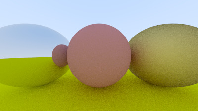

# Ray Tracing

Ray tracing library implementation in c++, following ray tracing in a weekend tutorials. Most stuff depends on domain knowledge. A good christmas week gone for this. 

I wish to make this a library so I can use this for future projects. after reading the theory of Ray tracing, I found Spheres to be the easiest shape to render.

I understand the c++ but it took time to understand the actual implmentation of ray tracer itself. the maths is easy linear algebra. 

<u> Plan to use multiple shapes </u>

<u> HELPFUL LINKS </u>

https://stackoverflow.com/questions/1943276/what-does-do-in-a-c-declaration

https://thoughtbot.com/blog/the-magic-behind-configure-make-make-install

https://stackoverflow.com/questions/11021452/how-do-redirect-stdout-out-of-xcode-compiled-command-line-executable?rq=4


# Cmake commands to build depending on OS
cmake -S <path to source> -B <path to build>

cmake --build ./build --config Release (windows)

make -C build/ (linux,mac) 

```
   cmake -S . -B build
   make -C build/
```

# Camera view point self.explanation


# Progress after creating a camera class


# Progress after creating metal class



# Anti Aliasing

Anti aliasing means decreasings aliasing. Since pixels are rectangle (or) square the objects that have curves on them or splines are difficult to render or they are usually jagged. In order to prevent this anti aliasing techniques are implemented.

# C++ NOTES

If the Vec3 class uses float instead of double then you see a strange pattern on the rendered sphere. I would like to continue with that till the end to see the difference it makes to the engine

operator overloading is basically dunder methods

function and constructor overloading means declare the function multiple times with same name but different parameters.

# <u> NOTES </u>
Shadow acne is when the intersection point of ray and object are not really on the object. Sometimes its below or above the obejct. It can cause the bouncing rays is unlikely to be perfectly off from the surface.

With a single ray through the center of each pixel, we are performing what is commonly called point sampling. The problem with point sampling can be illustrated by rendering a small checkerboard far away. If this checkerboard consists of an 8×8 grid of black and white tiles, but only four rays hit it, then all four rays might intersect only white tiles, or only black, or some odd combination. 

In the real world, when we perceive a checkerboard far away with our eyes, we perceive it as a gray color, instead of sharp points of black and white. That's because our eyes are naturally doing what we want our ray tracer to do: integrate the (continuous function of) light falling on a particular (discrete) region of our rendered image

Diffuse objects that don’t emit their own light merely take on the color of their surroundings, but they do modulate that with their own intrinsic color.They might also be absorbed rather than reflected. The darker the surface, the more likely the ray is absorbed (that’s why it's dark!)

There are types of reflections:

Lambertian reflectance is the property that defines an ideal "matte" or diffusely reflecting surface. The apparent brightness of a Lambertian surface to an observer is the same regardless of the observer's angle of view.[1] More precisely, the reflected radiant intensity obeys Lambert's cosine law, which makes the reflected radiance the same in all directions

In optics, Lambert's cosine law says that the radiant intensity or luminous intensity observed from an ideal diffusely reflecting surface or ideal diffuse radiator is directly proportional to the cosine of the angle θ between the observer's line of sight and the surface normal; I = Io cos θ.[1][2] The law is also known as the cosine emission law[3] or Lambert's emission law

notice that the 50% reflectance render (the one in the middle) is far too dark to be half-way between white and black (middle-gray). Indeed, the 70% reflector is closer to middle-gray. The reason for this is that almost all computer programs assume that an image is “gamma corrected” before being written into an image file. This means that the 0 to 1 values have some transform applied before being stored as a byte. Images with data that are written without being transformed are said to be in linear space, whereas images that are transformed are said to be in gamma space.

We are going to transform our data into gamma space so that our image viewer can more accurately display our image. As a simple approximation, we can use “gamma 2” as our transform, which is the power that you use when going from gamma space to linear space. We need to go from linear space to gamma space, which means taking the inverse of “gamma 2", which means an exponent of 1/gamma, which is just the square-root

defocus blur. Note, photographers call this depth of field,

We call the distance between the camera center and the plane where everything is in perfect focus the focus distance. Be aware that the focus distance is not usually the same as the focal length — the focal length is the distance between the camera center and the image plane

A slightly easier parameter is to specify the angle of the cone with apex (tip) at viewport center and base (defocus disk) at the camera center.