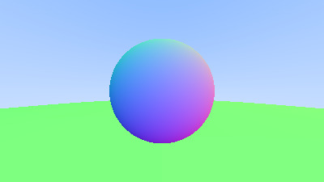

# Ray Tracing

Ray tracing library implementation in c++, following ray tracing in a weekend tutorials. Most stuff depends on domain knowledge. A good christmas week gone for this. 

I wish to make this a library so I can use this for future projects. after reading the theory of Ray tracing, I found Spheres to be the easiest shape to render.

<u> Plan to use multiple shapes </u>

<u> HELPFUL LINKS </u>

https://stackoverflow.com/questions/1943276/what-does-do-in-a-c-declaration

https://thoughtbot.com/blog/the-magic-behind-configure-make-make-install

https://stackoverflow.com/questions/11021452/how-do-redirect-stdout-out-of-xcode-compiled-command-line-executable?rq=4


# Cmake commands to build depending on OS
cmake -S <path to source> -B <path to build>

cmake --build ./build --config Release (windows)

make -C build/ (linux,mac) 

```
   cmake -S . -B build
   make -C build/
```

# Camera view point self.explanation


# Progress after creating a camera class



# Anti Aliasing

Anti aliasing means decreasings aliasing. Since pixels are rectangle (or) square the objects that have curves on them or splines are difficult to render or they are usually jagged. In order to prevent this anti aliasing techniques are implemented.

With a single ray through the center of each pixel, we are performing what is commonly called point sampling. The problem with point sampling can be illustrated by rendering a small checkerboard far away. If this checkerboard consists of an 8×8 grid of black and white tiles, but only four rays hit it, then all four rays might intersect only white tiles, or only black, or some odd combination. 

In the real world, when we perceive a checkerboard far away with our eyes, we perceive it as a gray color, instead of sharp points of black and white. That's because our eyes are naturally doing what we want our ray tracer to do: integrate the (continuous function of) light falling on a particular (discrete) region of our rendered image

Diffuse objects that don’t emit their own light merely take on the color of their surroundings, but they do modulate that with their own intrinsic color.They might also be absorbed rather than reflected. The darker the surface, the more likely the ray is absorbed (that’s why it's dark!)

<u> If the Vec3 class uses float instead of double then you see a strange pattern on the rendered sphere. I would like to continue with that till the end to see the difference it makes to the engine </u>

Shadow acne is when the intersection point of ray and object are not really on the object. Sometimes its below or above the obejct. It can cause the bouncing rays is unlikely to be perfectly off from the surface.