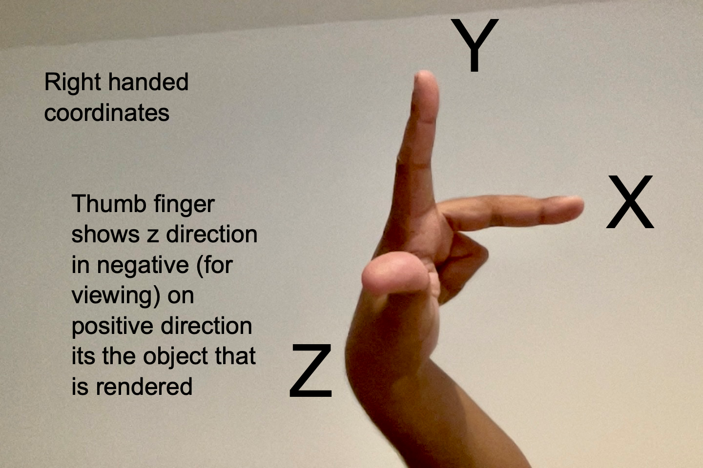

# ray_tracing
ray tracing in cpp

ray tracing library implementation in c++. 

plan to use multiple shapes

https://www.cs.rhodes.edu/welshc/COMP141_F16/ppmReader.html

https://courses.cs.washington.edu/courses/cse326/02wi/unix/g++.html

https://stackoverflow.com/questions/1943276/what-does-do-in-a-c-declaration

https://thoughtbot.com/blog/the-magic-behind-configure-make-make-install

https://stackoverflow.com/questions/11021452/how-do-redirect-stdout-out-of-xcode-compiled-command-line-executable?rq=4

```

   g++ -std=c++17 -o main -I /Users/harshaarya17/Documents/projects/ray_tracing/include ppm_image.cpp

```

```
   
   g++ -o main -I C:\Users\ASUS\Documents\cpp_projects\ray_tracing\include ppm_image.cpp

```

 cmake -S <path to source> -B <path to build>
 cmake --build ./build --config Release (windows)
 make -C build/ (linux,mac) 

```

   cmake -S . -B build
   make -C build/


```

